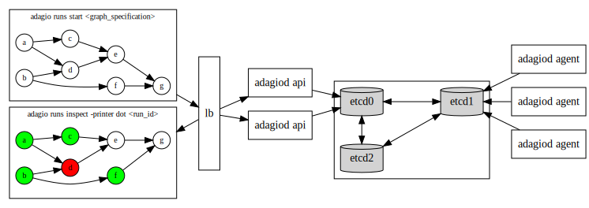

Adagio - A Workflow Orchestrator
----------------------------------

[](https://github.com/GeorgeMac/adagio/actions)



> This project is currently in a constant state of flux. Don't expect it to work. Thank you o/

Adagio is a workflow execution tool designed to run both locally and facilitate execution across a cluster of worker nodes.
A workflow is a directed acyclic graph (DAG) within which the vertices describe the work to be executed. The inputs and outputs are carried along the edges of the graph, piping the result from one vertex to the next. Each vertex awaits the execution of all its inbound edges to finish. Given all inputs finish successfully the vertex will be allocated and executed.

Adagio focusses primarily on orchestration of workflow execution. The execution of "work" defined within the vertices of the graph is intended to be extensible via a combination of native handlers and a plugin architecture. Rather than dictated by what can be implemented within this project.

# Usage

## adagio - cli

The adagio cli tool communicates with the control plane API. A running adagiod control plane API must be reachable.

```
adagio
adagio help          # show adagio command usage

adagio runs          # adagio runs usage

adagio runs ls             # list runs
adagio runs start [file]   # create and start runs
adagio runs start <stdin>
```

## adagiod - service

This daemon service consists of the adagio control plan API and the worker process. More documentation can be found [here](./cmd/adagiod).

# Building

```
➜  make
install                        Install adagio and adagiod
build                          Build adagio and adagiod into local bin dir
test                           Run test suite
test-with-integrations         Run test suite with integrations (i.e. etcd)
deps                           Fetch and vendor dependencies
protobuf                       Build protocol buffers into model and grpc service definitions
protobuf-deps                  Fetch protobuf dependencies
docker-build                   Build docker images
```

see `make help` for details locally.
